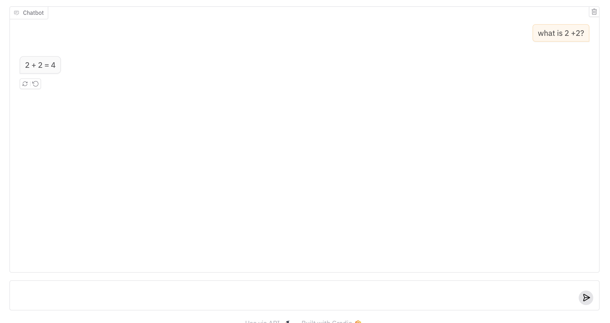
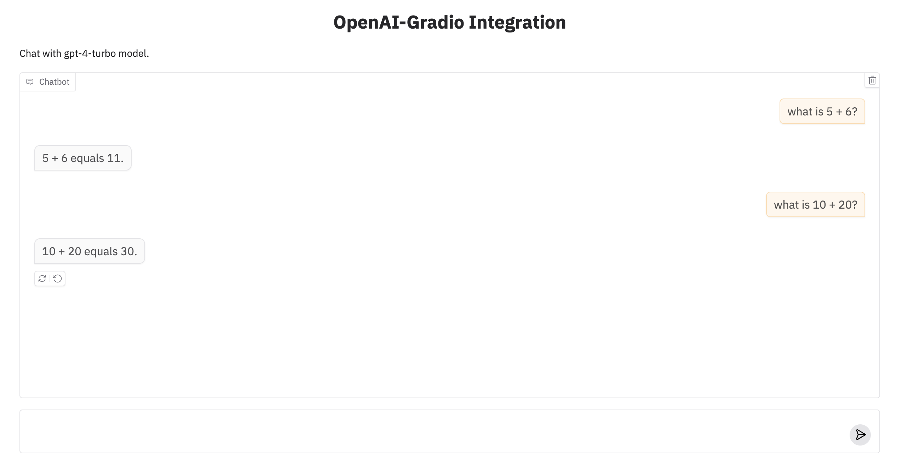

# `openai-gradio`

is a Python package that makes it very easy for developers to create machine learning apps that are powered by OpenAI's API.

# Installation

You can install `openai-gradio` directly using pip:

```bash
pip install openai-gradio
```

That's it! 

# Basic Usage

Just like if you were to use the `openai` API, you should first save your OpenAI API key to this environment variable:

```
export OPENAI_API_KEY=<your token>
```

Then in a Python file, write:

```python
import gradio as gr
import openai_gradio

gr.load(
    name='gpt-4-turbo',
    src=openai_gradio.registry,
).launch()
```

Run the Python file, and you should see a Gradio Interface connected to the model on OpenAI!



# Customization 

Once you can create a Gradio UI from an OpenAI endpoint, you can customize it by setting your own input and output components, or any other arguments to `gr.Interface`. For example, the screenshot below was generated with:

```py
import gradio as gr
import openai_gradio

gr.load(
    name='gpt-4-turbo',
    src=openai_gradio.registry,
    title='OpenAI-Gradio Integration',
    description="Chat with GPT-4-turbo model.",
    examples=["Explain quantum gravity to a 5-year old.", "How many R are there in the word Strawberry?"]
).launch()
```


# Composition

Or use your loaded Interface within larger Gradio Web UIs, e.g.

```python
import gradio as gr
import openai_gradio

with gr.Blocks() as demo:
    with gr.Tab("GPT-4-turbo"):
        gr.load('gpt-4-turbo', src=openai_gradio.registry)
    with gr.Tab("GPT-3.5-turbo"):
        gr.load('gpt-3.5-turbo', src=openai_gradio.registry)

demo.launch()
```

# Under the Hood

The `openai-gradio` Python library has two dependencies: `openai` and `gradio`. It defines a "registry" function `openai_gradio.registry`, which takes in a model name and returns a Gradio app.

# Supported Models in OpenAI

All chat API models supported by OpenAI are compatible with this integration. For a comprehensive list of available models and their specifications, please refer to the [OpenAI Models documentation](https://platform.openai.com/docs/models).

-------

Note: if you are getting a 401 authentication error, then the OpenAI API Client is not able to get the API token from the environment variable. This happened to me as well, in which case save it in your Python session, like this:

```py
import os

os.environ["OPENAI_API_KEY"] = ...
```